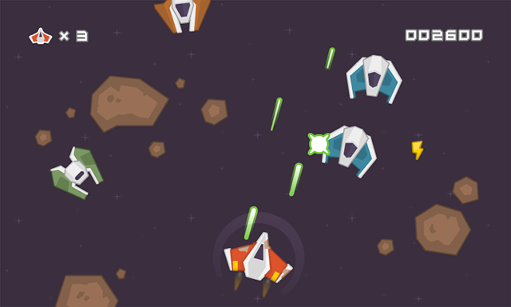

# Space Shooter

An [Asteroids](https://en.wikipedia.org/wiki/Asteroids_(video_game)) clone built in Go with [Ebitengine](https://ebitengine.org/), following the [Threedots tutorial](https://threedots.tech/post/making-games-in-go/).



## How to run

```bash
go run .
```

**Controls:** `S` rotate left · `F` rotate right · `Space` shoot

## Technical notes

- **AABB collision detection** — hand-rolled axis-aligned bounding box check (`Asset.Intersects`) with no physics library; used for both bullet-meteor and player-meteor collisions.
- **Circular spawn + vector navigation** — meteors spawn at a random point on a circle (radius = half the screen width) centred on the player, then move toward the player each tick using a normalized direction vector.
- **Tick-based timer** — a lightweight `Timer` struct counts game ticks rather than calling `time.Now()` in the hot path, converting a `time.Duration` to tick counts via `ebiten.TPS()` at construction time.
- **Compile-time asset embedding** — all sprites and fonts are baked into the binary via `embed.FS`, so the game ships as a single executable with no external asset files.
- **Proportional explosion scaling** — explosion sprites are scaled to match the size of the meteor they hit, so large meteors produce larger explosions without needing separate artwork.

## Assets

All assets from [Kenney — Space Shooter Redux](https://kenney.nl/assets/space-shooter-redux).
